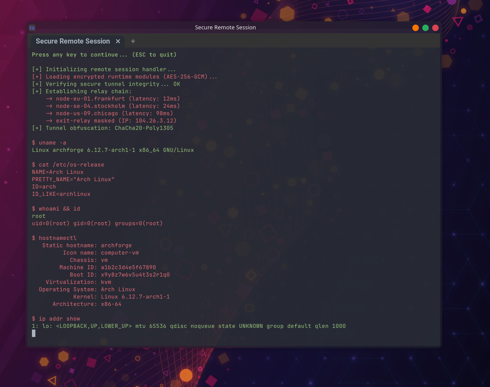
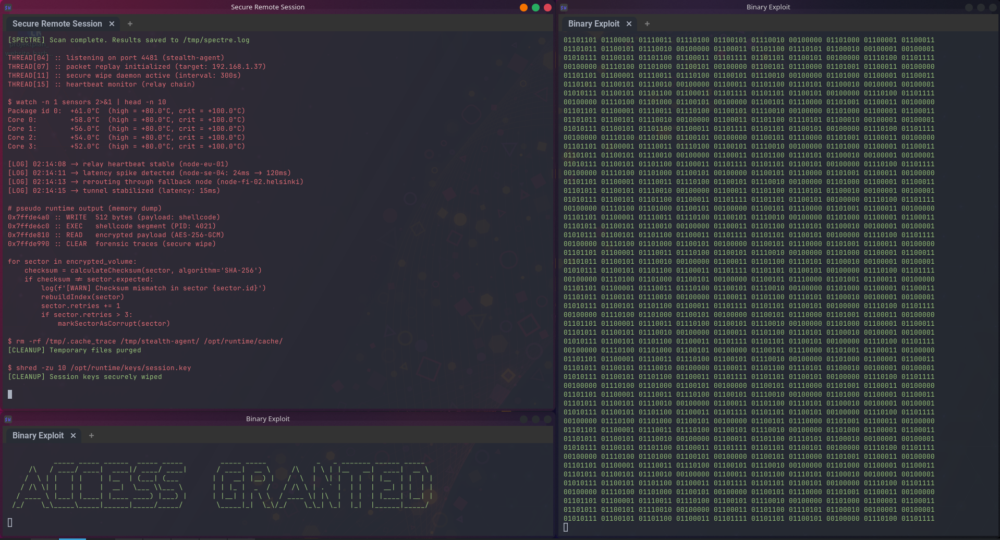

# Hacker Typer

## Intro

Use this the next time you enter `sudo apt update` and someone asks you if you're hacking...

## Usage

`main.py`:
1. Make sure you have Python 3.X.X installed and a terminal capable of rendering ANSII colors.
2. Download and run the script in your terminal.
3. Start pressing random keys to "hack".
4. Welcome to the *epic master hacker club*!
5. Press Escape or Ctrl-C to stop.

`binary-rain.py`:
1. Make sure you have Python 3.X.X installed and a terminal capable of rendering ANSII colors.
2. Download and run the script in your terminal.
3. Enjoy the rain!
4. Press Escape or Ctrl-C to stop.

`access.py`:
1. Make sure you have Python 3.X.X installed and a terminal capable of rendering ANSII colors.
2. Download and run the script in your terminal.
3. You have now access to... I don't know, it's up to your imagination.
4. Press Escape or Ctrl-C to stop.

## Why?

This obviously has no real word use, I made this for the sole purpose of pranking my friends.
Also, it was a lot of fun compiling the list of "hacker output"...

## Author

Annabeth Kisling

[annabeth@tk-dev-software.com](mailto:annabeth@tk-dev-software.com)

[tk-dev-software.com](https://tk-dev-software.com)